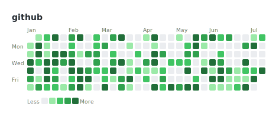
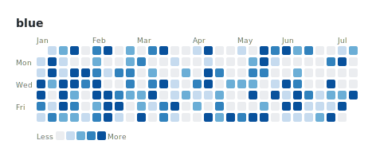
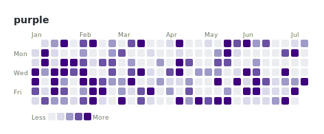
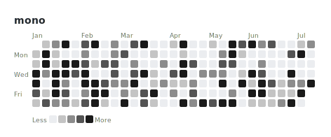
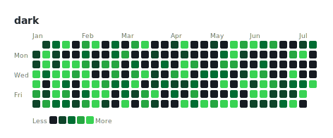

# Theme gallery

Every built-in theme, rendered against the same [`examples/workouts.csv`](../examples/workouts.csv)
dataset, so you can compare them side by side before picking one.

## github (default)



## blue



## purple



## mono

Grayscale — good for print or contexts that can't rely on color.



## dark

Inverts the base cell to near-black so it reads correctly embedded on a
dark-mode page, matching GitHub's own dark-mode contribution graph.



---

Regenerate these after a rendering change:

```python
from habit_heatmap import load_events, render_svg
from habit_heatmap.colors import THEMES

counts = load_events("examples/workouts.csv", value_col="minutes")
for theme in THEMES:
    open(f"docs/gallery/{theme}.svg", "w").write(render_svg(counts, theme=theme, label=theme))
```
